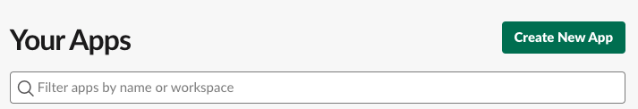
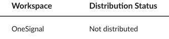
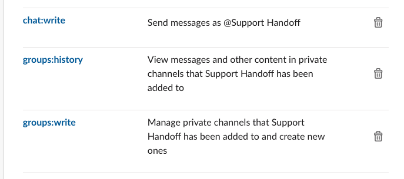

# A breakdown of interacting with the Slack API and deploying a bot:
- I will be talking about this from my own experience of building Support Handoff which lives in the private #support-onesignal-team. It was definitely an interesting process setting this up, but when things fell into place, the layout for working with slack's block builder is actually very intuitive and the different variations to customize the behavior can make the bot super unique and fun to work with.

<u> What I used to build this: </u>
- Slack's Node JS client [boltjs](https://api.slack.com/tools/bolt) (There is also a Java/Python package available)
- Hosted the Node project on a free [Cyclic](https://www.cyclic.sh/) server ([Ngrok](https://ngrok.com/) is great for testing when using Slack's [Events API](https://api.slack.com/apis/connections/events-api))

## <u>Getting Started</u>:
1. Go to the [Slack API](https://api.slack.com/apps) and log in to your account. You should then see a section called your apps:


<hr/>

2. You can now create a new app, add a name and choose a workspace to set this up in. Keep in mind that this will only be available within the workspace you choose unless you choose to distribute the project (requires web services).


<hr/>

3. We can now get started on getting all permissions for the bot set up. Navigate to the Basic Information settings and start by setting up features and functionality from the drop down. For now we'll just select "Bot" and anything else will be added automatically as we proceed.


<hr/>

4. Now we need to determine if we need to use Events or not. If not, it's very simple to get set up with [Socket Mode](https://api.slack.com/apis/connections/socket). Just turn it on and you're essentially ready to set up your OAuth, so you can move to the next step. 

 > To work with events, you will need to add a request URL. To set this up, I'd recommend using ngrok in testing and route your local host server to an https url provided by the service. You can follow the guide at the top to get set up with this service.
 <hr/>

 5. Let's get into OAuth and Permissions/Scope now. Every action that the bot takes will require some kind of permission and a scope to which they can perform that action. You can see a few examples here of a bot with permissions to read and write in private channels.
 <br/>

 

> The descriptions here are very self explanatory so we won't get too deep into them. The main reminder here is to catch errors in your code as Slack will explicitly tell you which permissions are missing if you need to add more.
<hr/>

6. Once at least one permission has been added, you can now install the bot to the workspace. Go up to the *OAuth Tokens for Your Workspace* section and click "Install". You'll then be greeted with the private tokens for your bot. No need to save anything just yet, we can come back to this later.
<hr/>

7. Last step for the Slack UI portion here, is to get your Slack Token. Under Basic Information, you should see a section called "App Level Tokens". We can generate a new token simply titled "token" and again add the necessary scope


<hr/>

## <u>Let's Start Building Our Slack Bot</u>:

1. Now we can begin building the slack bot and implementing the logic that works behind the scenes. For the bot that I built, I used the following packages:
`@slack/boltjs` & `dotenv` 
<hr/>

2. Create a `.env` file now so we can make sure to hide the private tokens before pushing the bot to production later. You'll need at least three variables:
```
BOT_TOKEN=<Found in OAuth and Permissions page>
SLACK_TOKEN=<Found in Basic Information under App Level Tokens>
SIGNING_TOKEN=<Found in Basic Information under App Credentials>
```
<hr/>

3. Once the necessary packages are imported, we can initialize our Slack Bot using the following syntax:
```
require('dotenv').config();
const {App} = require('@slack/bolt');

const app = new App({
    socketMode: true, //remove this line if using events
    token: process.env.BOT_TOKEN
    appToken: process.env.SLACK_TOKEN,
    signingSecret: process.env.SIGNING_TOKEN
});
```
<hr/>

4. Let's make sure that everything is working properly by settin up a quick app start method that will run the app automatically when running this JS file with node:
```
(async () => {
    await app.start(process.env.PORT || 3000);
    console.log("Bolt app is running!);
})();
```
<hr/>

5. If everything looks good so far, let's move on and build the brain of the bot. *If not, confirm the tokens are correct and that the environment variables you set are able to be read from the js file*. Let's begin with a simple message to the channel:
```
const sendMessage = async() => {
    try {
        await app.client.chat.postMessage({
            token: process.env.BOT_TOKEN,
            channel: '#general',
            text: 'Time to check in!',
            blocks:[{
                "type":"section",
                "accessory": {
                    "type": "button",
                    "text": {
                        "type":"plain_text",
                        "text":"Click Me"
                    },
                    "action_id": "click"
                }
            }]
        })
    } catch(error) {
        console.error(error);
    }
}
```
Let's walk through this example:
- First thing to note here is that this is going to return a promise, so we are going to set this up in an aysnc function and await the `app.client.chat.postMessage()`
- Inside the options for this method, we can see we're again adding the token (this is not required in all cases), setting the destination channel, outputting text to that channel, and adding a button.
- The button has normal text but also includes an action_id which lets us handle that click event however we want. 
<hr/>

6. Let's add the bot to our channel and run the server! Go to your channel and click "integrations" and add your bot. Now from the terminal, navigate to the directory where your js file is located and run `node <name of your file>.js`. You should then see the message appear in the chat!


<hr/>

## <u>In Summary</u>: 
This is just a simple example of how you would work with Slack's [Block feature](https://api.slack.com/block-kit/building), there's so much more to add and I'd definitely suggest playing around with their [Block Builder](https://api.slack.com/tools/block-kit-builder)!

- **You can open DM's with users using `conversations.open` and passing in user id's**
```
const openPrivateConversation = await app.client.conversations.open({users: exampleUserId});
```

- **You can open modals by listening to the action_id**
```
app.action("click", async({ ack, body, client}) => {
    await ack();
    await client.views.open({
        trigger_id: body.trigger.id,
        view{
            "type":"modal",
            "callback_id":"check_in_modal",
            "title": "Hey there!"
            etc ... 
        }
    })
})
```

#### All in all this was a really fun project and with Slack's large API to work with, there's a bunch more features to keep adding to the bot to make it more interactive and useful for different use cases. Definitely check out the tutorials and reference to see what else you can add to your bot!


Hope this was helpful to anyone trying to build out their own slack bot!
-Dom